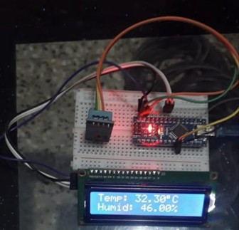

# Temperature and Humidity Monitoring System using Arduino Nano & DHT11

## Overview

This project is a **real-time Temperature and Humidity Monitoring System** built using **Arduino Nano** and **DHT11 sensor**.
It measures environmental conditions and displays them on a **16x2 LCD display**.
This system is simple, low-cost, and useful for applications like weather monitoring, smart homes, and industrial environments.

---

## Features

* Real-time temperature monitoring
* Humidity measurement
* LCD display output
* Low-cost and efficient system
* Continuous data updates every 2 seconds

---

## Components Used

* Arduino Nano
* DHT11 Temperature & Humidity Sensor
* 16x2 LCD Display (I2C)
* Breadboard
* Jumper Wires
* USB Cable

---

## Working Principle

The **DHT11 sensor** measures temperature and humidity from the environment.
The data is sent to the **Arduino Nano**, which processes it and displays the results on the **LCD display**.

---

## 🔌 Circuit Connections

* DHT11 VCC → 5V

* DHT11 GND → GND

* DHT11 Data → D7

* LCD VCC → 5V

* LCD GND → GND

* LCD SDA → A4

* LCD SCL → A5

---

## 💻 Code

```cpp
#include <Wire.h>
#include <LiquidCrystal_I2C.h>
#include <DHT.h>

// Define I2C LCD address
LiquidCrystal_I2C lcd(0x27, 16, 2);

// Define DHT sensor pin and type
#define DHTPIN 7
#define DHTTYPE DHT11

DHT dht(DHTPIN, DHTTYPE);

void setup() {
  lcd.init();          
  lcd.backlight();     
  dht.begin();         

  // Welcome message
  lcd.setCursor(0, 0);
  lcd.print("Jagdamba College");
  lcd.setCursor(0, 1);
  lcd.print("of Engineering");
  delay(3000);

  lcd.clear();
}

void loop() {
  float h = dht.readHumidity();
  float t = dht.readTemperature();

  // Error check
  if (isnan(h) || isnan(t)) {
    lcd.setCursor(0, 0);
    lcd.print("Sensor Error!");
    delay(1000);
    return;
  }

  // Temperature display
  lcd.setCursor(0, 0);
  lcd.print("Temp: ");
  lcd.print(t);
  lcd.print((char)223); // degree symbol
  lcd.print("C ");

  // Humidity display
  lcd.setCursor(0, 1);
  lcd.print("Humid: ");
  lcd.print(h);
  lcd.print("% ");

  delay(2000);
}

```
---


## 📊 Output

The LCD displays:

* Temperature in °C
* Humidity in %

Example:

```
Temp: 32.3°C
Humid: 46.0%
```

---

## Future Improvements

* IoT integration (cloud monitoring)
* Mobile app connectivity
* Data logging and analytics
* Alert system for threshold values

---

## Author

**Khushi Bhagat**

---
